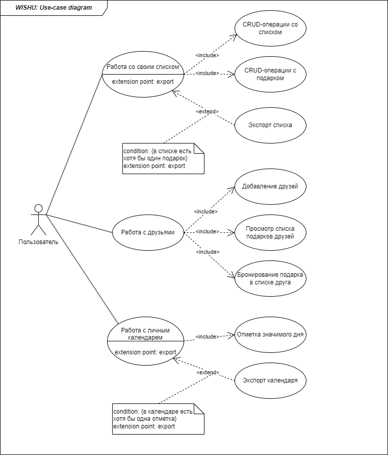

# Определение контекста и требований к системе

## Перечень заинтересованных лиц (стейкхолдеров) с краткими описаниями:

1. Научный руководитель проекта. Заинтересован в успешной сдаче командного проекта. Является приобретающей стороной.
2. Команда проекта: продуктовый аналитик и тестировщик, системный аналитик, Backend-разработчик, Frontend-разработчик. Также заинтересованы в успешной сдаче проекта.
3. Пользователи, уверенно использующие возможности ПК и имеющие опыт работы в веб-приложениях. Основные пользователи приложения. 
4. "Пользователь-новичок". Готов использовать приложение только при отсутствии трудностей при работе с ним.

## Перечень функциональных требований:

- работать со своим списком подарков:
	- создавать список для события с указанием названия и даты события, редактировать и удалять список;
	- создавать подарок в списке с указанием названия, фотографии и ссылки на него, редактировать и удалять подарок из списка;
	- экспортировать список с помощью настройки доступа по ссылке;
- работать с друзьями:
	- добавлять друзей;
	- просматривать списки подарков друзей с отображением статуса брони подарков;
	- бронировать доступный подарок в списке друга;
- работать с личным календарем:
	- отмечать значимые дни c указанием названия и описания;
	- экспортировать календарь.

## Диаграмма вариантов использования для функциональных требований:

## Перечень сделанных предположений:

- экспортировать календарь в формате .ics;
- добавить возможность ограничить видимость списка от некоторых друзей, сделать список публичным (доступным по ссылке) и приватным;
- регистрация пользователя по email.

## Перечень нефункциональных требований:

Проанализируем бизнес-требования и дополнительный контекст:

1. *Веб-приложение, страница должна адекватно открываться и на ПК, и на мобильном устройстве*.
Это значит, что приложение должно быть **кросс-платформенным**.

2. *Пользователи: сотни, тысячи пользователей*.
Соответственно число пользователей может возрасти, поэтому приложение должно быть **масштабируемым**.

3. *В приложение заносятся персональные данные, их сохранность и безопасность имеет значение*.
Как минимум заносятся регистрационные данные. Также пользователь ведет личный дневник событий, нельзя допустить, чтобы у злоумышленников
был доступ к данным. Поэтому возникает требование **безопасности пользовательских данных**.

4. Предположительно, под классические праздники (Новый год, 8 марта, 23 февраля и др.) может возрасти нагрузка на сайт. Поэтому помимо масштабируемости
приложение должно обладать **адаптируемостью**.
